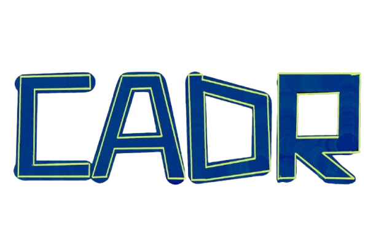
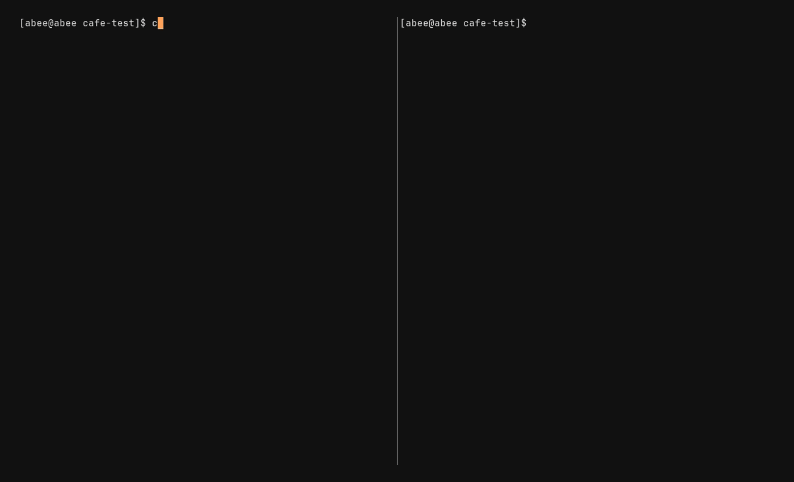

<p align="center">
  
</p>

<p align="center">
  <b>The cadastre for your codebase.</b><br>
  <i>100% local. Real-time. No cloud.</i>
</p>

<p align="center">
  
  
  
</p>

<hr />

<p align="center">
  <!-- <video src="https://github.com/user-attachments/assets/7d523ad0-d2a6-403e-a879-e9f3cd1344e0" width="850" autoplay loop muted></video> -->
  
</p>

cadr shows you a real-time map of your codebase's execution flow directly in the terminal. Explore complex application logic and legacy codebases without relying on manual logs, or "KT's" if you're using it at work :p

cadr has three primary systems:
1. **Static Analyzer (TreeSitter)**: Parses the project directories to build a weighted structural dependencies graph.
2. **Dynamic Tracer**: Uses `PYTHONPATH` or `NODE_OPTIONS` injection to hook into target applications, transmitting TCP payloads of your service line-by-line back to the cadr daemon. Native support for multi-threading, multi-processing, and web subprocesses (Flask, Uvicorn, Express, NestJS).
3. **Interactive TUI**: Sticks and follows to the live execution feed, providing a TUI for navigating execution paths chronologically or structurally in a way vim users can appreciate.

---

## Installation

### linux/macOS

#### Download Binary
Download latest binary from [Github Releases.](https://github.com/abhinavdevarakonda/cadr/releases) 

#### go install
```bash
go install github.com/abhinavdevarakonda/cadr/cmd/cadr@latest
```

#### Build from Source
> Requires a C compiler due to CGO (treesitter)
```bash
git clone https://github.com/abhinavdevarakonda/cadr
cd cadr
go build -o cadr ./cmd/cadr
sudo mv cadr /usr/local/bin/ # Add to PATH
```

### Windows

#### WSL (Recommended)
Follow the Linux instructions inside your WSL terminal.

#### Native PowerShell
1. **Prerequisite:** Install a C compiler (e.g., `scoop install gcc` or `choco install mingw`).
2. **Install:**
```powershell
go install github.com/abhinavdevarakonda/cadr/cmd/cadr@latest
```
*Note: the TUI would look cleaner and more consistent if using Windows Terminal.*

---

## Getting Started
> Note: cadr currently provides full dynamic execution tracing for Python and JavaScript/TypeScript. Static analysis and project navigation are supported for Python, Go, C, and JavaScript/TypeScript. Additional languages will be added soon! (I just deal with those more than others, so I had to add them first.)

cadr operates in a dual-pane workflow. The left pane shows you the structure, while the right pane shows what's running and its relationships, tracing the flow the codebase takes during runtime.

**1. Start the cadr Daemon**:
```bash
# Analyze the current directory and start the TUI
# Just 'cadr' is enough if you want the TUI to start in the working directory
cadr .
```

**2. Execute Your Application**:
```bash
# cadr will inject the environment variables and execute the process
cadr run "python app.py"
```
*(you can substitute `python app.py` based on your framework; `node app.js`, `npm start`, `flask run`, `uvicorn main:app`, `pytest`, etc.)*

### Other Quick Tools (WIP)
> cadr will show the whole codebase structure through [cytoscape.js](https://js.cytoscape.org/) at `localhost:6433`
```bash
cadr serve .
```

---

## Technical Features

### Real-time Trace Visualization (`cadr`)
As the process executes, cadr maps the incoming trace payloads onto the pre-made static graph:
- **Heatmap**: Nodes in the structure tree visually scale based on execution frequency (function hit counts).
- **Chronological Playhead**: The right-hand pane records a linear sequence of execution events.
- **Dynamic Unrolling**: The structural tree (left pane) will automatically jump through directories to focus on active function/section in the real time trace execution.
- **Fallback Navigation**: if your app executes dynamically generated code like a Jinja2 template that cadr's static graph can't find, it will still capture the exact file and line number so you can instantly open it in your editor by just hitting enter on the function.

### Advanced TUI Controls
cadr uses standard Vim keybindings (`j/k/h/l`, `gg/G`, `/` for fuzzy search, `ctrl+j/k` for jumps).

These are the cadr-specific bindings:

| Key | Action |
| :--- | :--- |
| `i` | Toggle focus between the Left (Structure) and Right (Trace/Impact) panes. |
| `c` | **State Toggle**: Collapse the entire tree to the root. Press again to restore your previous exact folder state. |
| `enter` | Open the selected directory/file/function in your `$EDITOR` precisely at that line number. |
| `f` | Toggle **Follow Live**: Stops the left pane from auto-scrolling through the real-time function calls so you can inspect code while the app runs. |
| `Space` | Toggle **Live/Pause**: Pause the UI to inspect a specific moment in the trace without losing data. Press again to unpause and go back to current execution calls. |
| (shift+) `H` / `L` | scrub backwards or forwards through the chronological trace history. |
| `t` / 'Tab' | Cycle right pane between **Flow** (sequence), **Impact** (callers), and **Trace** (callees). |


---

## cadr MCP Server

cadr exposes its static graph and dynamic analysis tools as an **MCP** server. This allows AI assistants (like Claude, Cursor, or Antigravity) to see your code structure and follow execution flows without manual grepping.

### Setup
Add cadr to your agent's MCP configuration (e.g., `claude_desktop_config.json`). 
> Different MCP clients use different configuration formats for registering servers, so refer to your client's documentation if needed. This one below works for Antigravity.
```json
{
  "mcpServers": {
    "cadr": {
      "command": "cadr",
      "args": ["mcp"]
    }
  }
}
```

### MCP Tools
cadr provides the AI with 12 tools to understand code deeply, these are just a few of them:
- **`call_path`**: Find a call path between two functions
- **`impact_analysis`**: Transitively find all functions affected if this function changes
- **`get_last_trace`**: Read the last recorded trace from `.cadr/last_run.jsonl` (created by `cadr rec`). Returns function calls with parameters.
- **`run_trace`**: Run an arbitrary command and trace its function calls dynamically in the background
